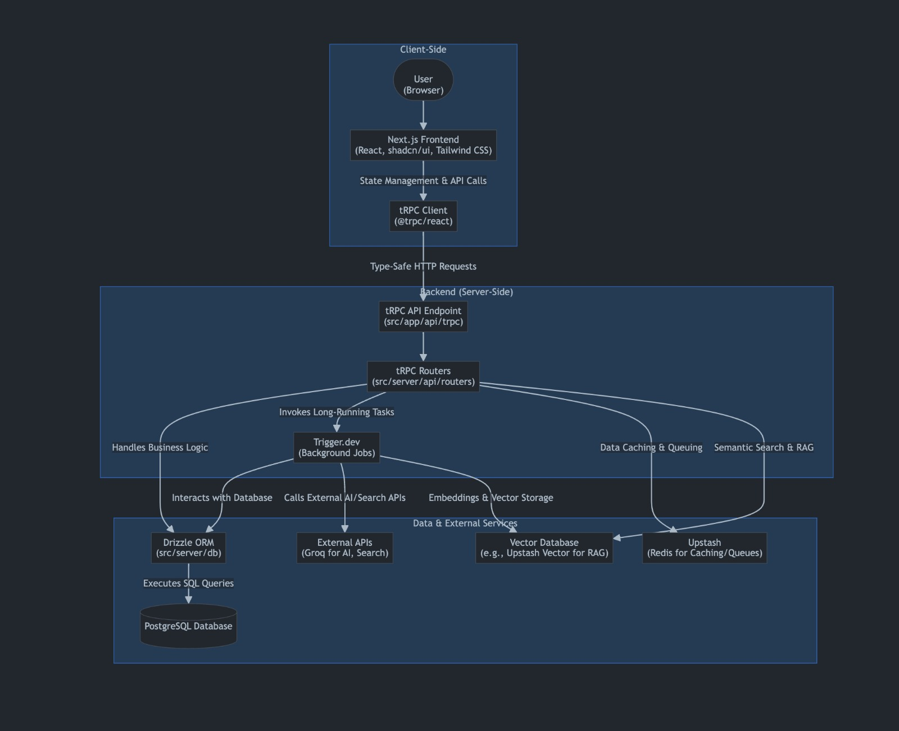

# Hackathon Adapt

Hackathon Adapt is an experimental platform for generating and delivering course content with the help of AI. It contains:

- **Backend** – Python agents that create course outlines, flashcards, quizzes and podcasts.
- **Frontend** – a T3 stack web application for interactive learning with chat and document ingestion.

## Architecture

The application is composed of a modern frontend (Next.js, shadcn/ui, Tailwind CSS) and a backend with Python agents and a tRPC API. The backend handles business logic, interacts with the database, and calls external AI/search APIs. The frontend communicates with the backend via type-safe HTTP requests using tRPC.



## Flow

The diagram below illustrates the flow of data and requests in the application. The user interacts with the Next.js frontend, which manages state and API calls. These requests are sent to the backend via tRPC, which can invoke background jobs, interact with the database, and call external APIs for AI and search. Data is stored in PostgreSQL and vector databases, with caching and queuing handled by Upstash.


## Requirements

- Python 3.10+ for the backend
- Node.js 18+ and `pnpm` for the frontend
- Docker or Podman to start the local Postgres database

You will also need API keys for OpenAI and other services as noted in `frontend/README.md`.

## Backend usage

Install the Python dependencies:

```bash
pip install -r backend/requirements.txt
```

Set the `OPENAI_API_KEY` environment variable and run the course content generator:

```bash
python backend/course_content_agent.py "Tema do curso"
```

This creates three files in the current directory:

- `course_content.json` – the generated course outline
- `flashcards.json` – flashcards for each lesson
- `quiz.json` – a multiple-choice quiz

The backend also exposes a FastAPI app via `backend/modal_app.py` with endpoints to generate course packages and podcasts.

## Frontend setup

From the `frontend` directory install the dependencies and start the development database:

```bash
pnpm install
./start-database.sh
```

Create a `.env` file with the variables listed in `frontend/README.md` and run the dev server:

```bash
pnpm dev
```

The web app will be available on [http://localhost:3000](http://localhost:3000).

## Database schema

A complete PostgreSQL schema is provided in `schema.sql` which matches the structure used by the application.

---

This repository is a hackathon project and is provided as-is.
